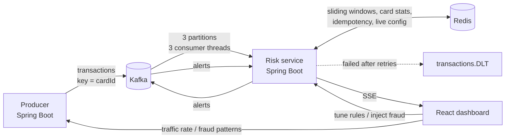
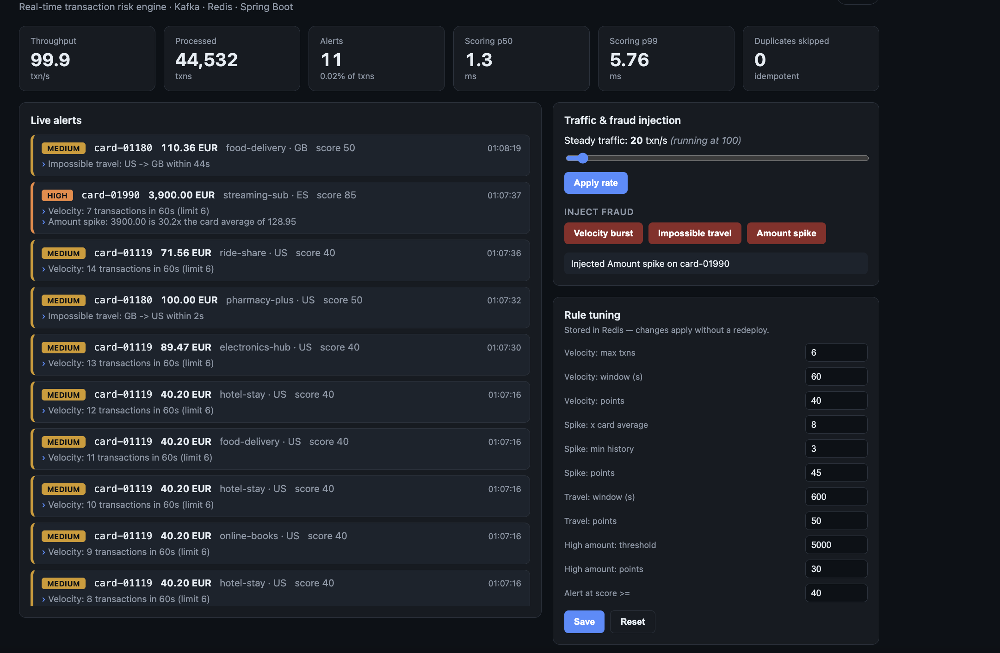
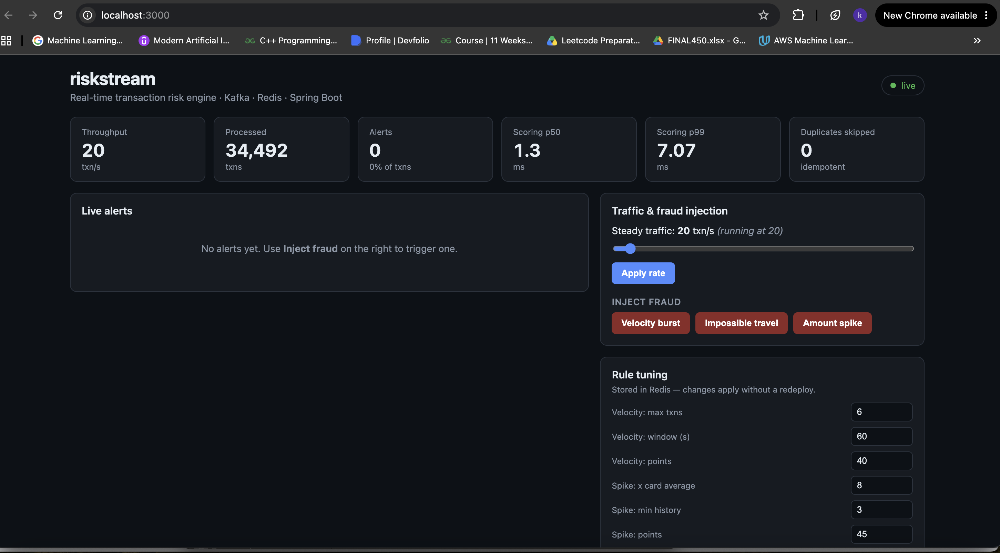
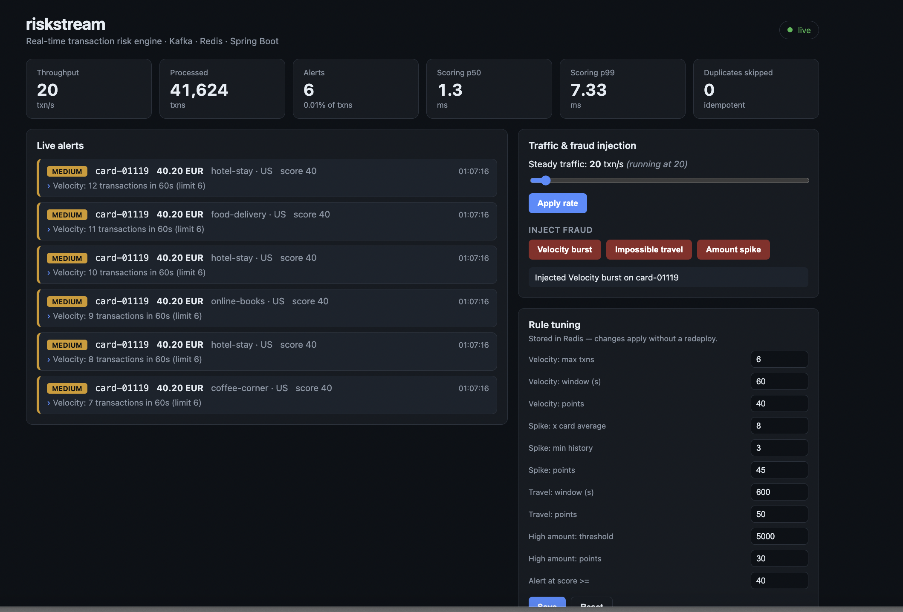

# riskstream

**A real-time card-transaction risk engine.** Synthetic transactions stream through Kafka, a Spring Boot service scores each one against Redis-backed fraud rules, and flagged transactions appear instantly in a React dashboard, where the rules can be tuned live without a redeploy.

Built to demonstrate event-driven design with **Java 21 · Spring Boot 3 · Apache Kafka (KRaft) · Redis · React + TypeScript · Docker**.



## Quick start

Requirements: Docker (with Compose). Nothing else.

```bash
docker compose up --build
```

Then open **http://localhost:3000**. Steady traffic starts immediately. Use **Inject fraud** to trigger alerts, and **Rule tuning** to change thresholds live.

<details>
<summary>Developing without Docker for the Java/React code</summary>

Requires Java 21, Maven, Node 22.

```bash
docker compose up kafka redis          # infrastructure only
mvn -q -DskipTests package             # build all modules
java -jar risk-service/target/risk-service-0.1.0.jar &
java -jar producer/target/producer-0.1.0.jar &
cd dashboard && npm install && npm run dev   # http://localhost:5173 (proxies /api to the services)
```
</details>

## What it detects

Each rule contributes points; a transaction becomes an alert when the total reaches the threshold (default 40). Severity: `MEDIUM` < 60 ≤ `HIGH` < 90 ≤ `CRITICAL`.

| Rule | Fires when | Redis structure |
|---|---|---|
| **Velocity** | more than N transactions on one card inside a sliding window (default 6 / 60 s) | sorted set, atomic Lua script |
| **Amount spike** | amount is more than X times the card's own running average (default 8x, after 3 purchases) | hash `count`, `sum` |
| **Impossible travel** | same card in two different countries within a short window (default 10 min) | hash `country`, `ts` |
| **High amount** | single amount above an absolute threshold (default 5,000) | stateless |

Rules are corroborating signals: a high amount alone (30 pts) does not alert, but a high amount abroad or a spike does.

## Design decisions

- **Keyed by card ID.** All events for one card go to the same partition, so a card's transactions are processed in order by a single consumer thread. That is what makes per-card state (velocity windows, travel checks) correct without distributed locking.
- **At-least-once delivery + idempotency.** Kafka may redeliver. Each transaction ID is claimed in Redis (`SET NX` with a 1 h TTL) before scoring; if scoring throws, the claim is released so retries work. Sliding-window inserts are naturally idempotent (the member is the transaction ID).
- **Atomic sliding window.** Trim, insert and count run as one Lua script, so concurrent consumers can never observe a half-updated window and only one Redis round trip is needed.
- **Failure handling.** A failing record is retried 3 times (500 ms apart), then published with its error to `transactions.DLT`. An `ErrorHandlingDeserializer` routes undeserializable messages (poison pills) there too, so one bad message never blocks a partition.
- **Live rule tuning.** Thresholds live in a Redis hash and are cached in-process for 1 s. Edits from the dashboard are validated server-side and take effect on every instance almost immediately, with no redeploy.
- **Pure, testable core.** The rule engine has no Spring or Redis dependency; it talks to a small `RiskStateStore` interface. Rules are unit-tested against an in-memory implementation, and the Redis implementation is tested against a real Redis via Testcontainers.
- **Alerts fan out through Kafka.** The `alerts` topic is a proper output stream (case management, notifications, etc. could subscribe). The dashboard bridge uses a unique consumer group per instance, so every instance sees every alert and can serve its own SSE clients.
- **Money as `BigDecimal`** on the wire and in the model; timestamps are epoch-millis event time.

## API

| Method | Path | Description |
|---|---|---|
| GET | `/api/alerts` | recent alerts (newest first) |
| GET | `/api/alerts/stream` | live alerts as Server-Sent Events |
| GET / PUT | `/api/config` | read / update rule thresholds (validated) |
| POST | `/api/config/reset` | restore defaults |
| GET | `/api/stats` | processed / alert counts, scoring latency percentiles |
| POST | `/api/producer/rate?tps=N` | set steady traffic rate (0–5000) |
| POST | `/api/producer/fraud/{velocity\|travel\|spike}` | inject a fraud pattern |
| GET | `/actuator/prometheus` | Micrometer metrics (both services) |

## Testing

```bash
mvn verify
```

- Rule and engine unit tests (no infrastructure).
- Redis store tests using Testcontainers (skipped automatically if Docker is unavailable).
- CI runs both plus the dashboard build on every push (`.github/workflows/ci.yml`).

## Performance

`scripts/bench.sh` steps the producer through 100 / 500 / 1000 / 2000 txn/s against the running stack and prints achieved throughput and scoring latency percentiles.

_Measured on: MacBook Air (Apple Silicon, 8 GB RAM), Docker via OrbStack. Producer, Kafka, Redis and risk-service all on the same laptop._

| Target txn/s | Achieved txn/s | Scoring p50 (ms) | Scoring p99 (ms) |
|---|---|---|---|
| 100 | 100 | 1.24 | 9.43 |
| 500 | 500 | 0.91 | 5.24 |
| 1000 | 1001 | 0.78 | 4.19 |
| 2000 | 2004 | 0.82 | 4.71 |



Scoring latency is the time the risk service spends evaluating one transaction (four rules, several Redis round trips), not end-to-end latency through Kafka. The 100 txn/s row is slower mainly because it runs first, while the JVM is still warming up. The system kept up with the target rate at every step, so the ceiling on this machine is above 2,000 txn/s; the next step is finding it.

## Project layout

```
common/        shared event contracts (Transaction, Alert, topic names)
producer/      synthetic traffic generator + fraud injection API
risk-service/  Kafka consumer, rule engine, Redis state, SSE + REST API
dashboard/     React + TypeScript + Vite UI
docs/          architecture walkthrough

```




(docs/images/alerts1.png)


## Limitations and next steps

- Single-broker Kafka and single Redis: fine for a demo, not for production (replication, Redis Sentinel/Cluster would be next).
- Rules are hand-tuned heuristics; a natural extension is a scoring model fed by the same Redis features.
- Windows are keyed on event time and assume per-card ordering (guaranteed by partitioning, not across re-keying).
- Next: Grafana dashboards on the Prometheus endpoints, a DLT replay tool, and a Terraform module to deploy to AWS (MSK + ElastiCache + ECS).
